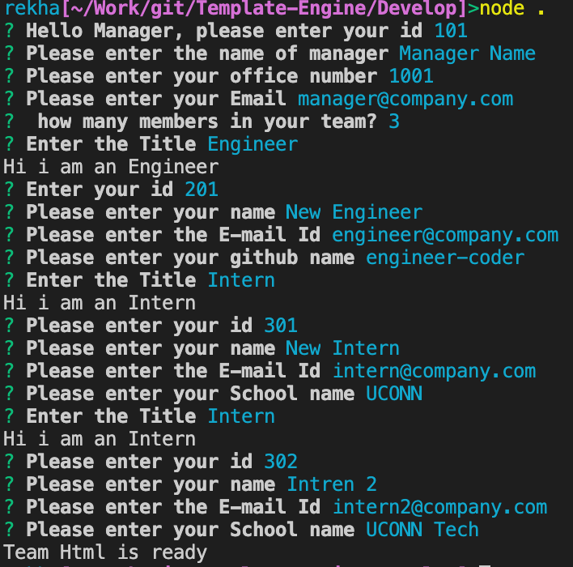
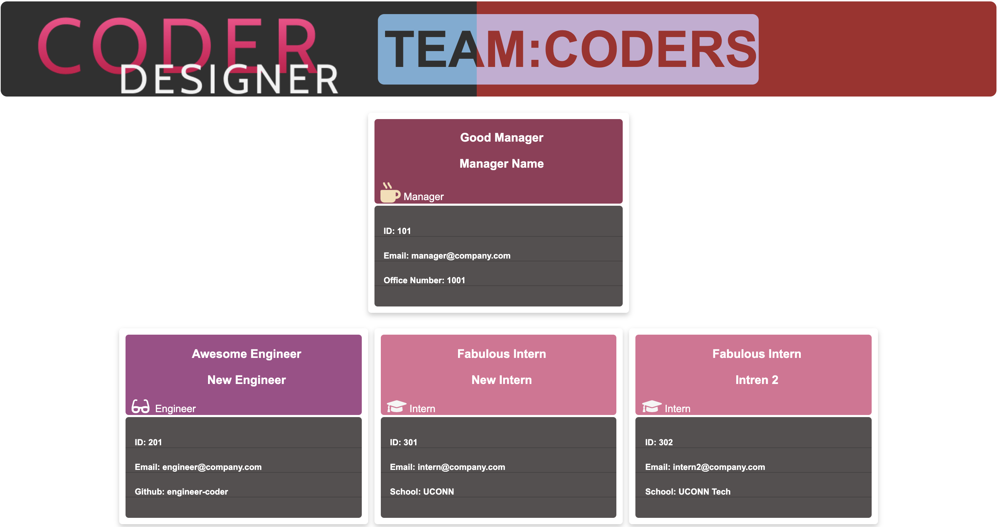

# Template-Engine
**Engine to produce a team memebers info**

This Node application provides a nice looking team card by gathering members information.

---

## Overview 
####The Node app users following packages
- inquirer - To gather team members information 
- jest - To test the application
- fs - To generate HTML file
---  
## Process Flow
#### Team template generation
This process is intitiated by inquirer providing options to 
- Enter team members information like Name, email, school etc based on user type
  

- All the information is fead to classes (Manager, Engineer, Intern which are of type Employee)
- Uses these Class objects HTML template generates individual memeber card
- Finally fs package is used to put all the information into HTML file
  
---
#### Test framework
- jest uses classes to validate various methods and data
  
  

### GIF

